# [BATTLESHIPS](https://battleships84-ac97f9b3f0c3.herokuapp.com)

Battleships is a simple python terminal game which runs in the Code Institute mock terminal on Heroku. Designed for a player to compete against the computer in search of the computers random generated battleship in a grid structure.

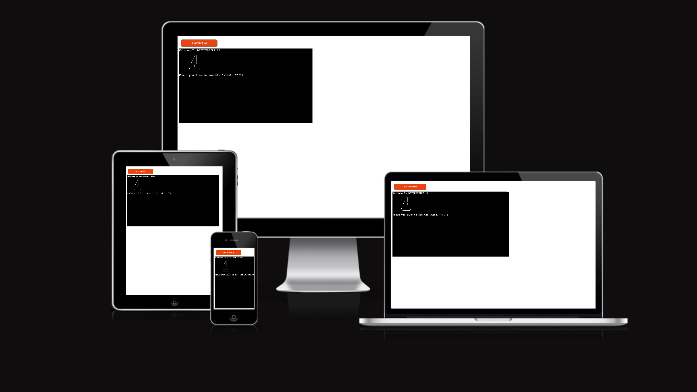

## The Game

Battleships allows the player up to six guesses per game on a grid size of 5 x 5. The player is hunting down one ship which is no bigger than 1 square. If the player guesses incorrectly a ‘X’ will be marked on the grid and the player has six attempts to hit the ship until the game is over and the player has lost. However, if the player gets a direct hit a ‘@’ will be marked and the player has won.

## Features

### Existing Features

- **Rules**

    - The rules feature allows the Player who is either new or old to the game the option of viewing the rules before beginning the game. Keeps the game looking clean.

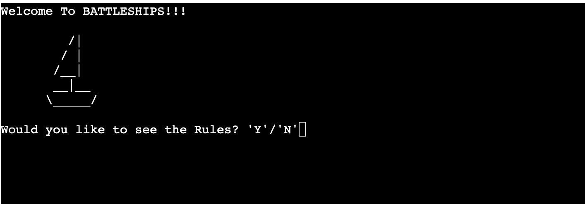

- **start**

    - The start message gives the player the option of proceeding to the game or exiting out of the game.

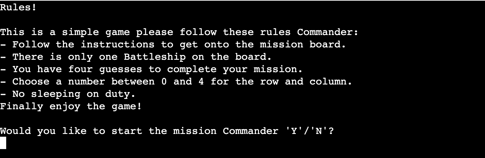

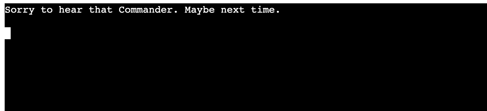

- **Guessing**

- The board is displayed and the player is prompted to add their guess. Guess row & Guess Col.

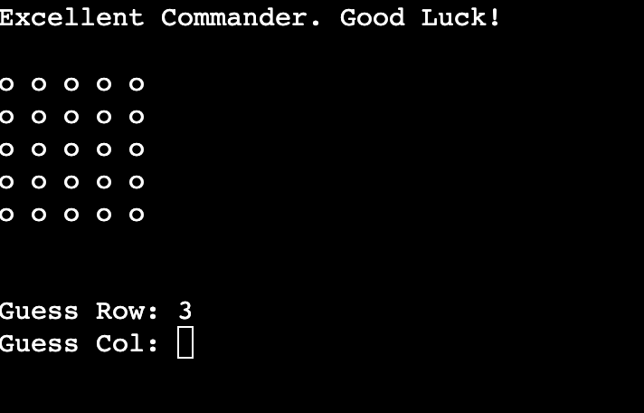

-	If the player misses on the board a ‘X’ and a message will appear informing the player. The player will also have used up a guess.

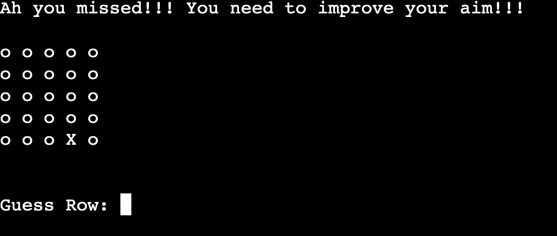
-	If the player guesses a number off the grid, then another message will appear informing the player. Also, the player will not lose a guess for that error.

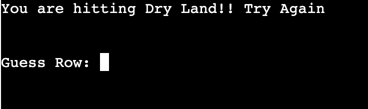

-	If the player hits the same guess as before then another message will appear.

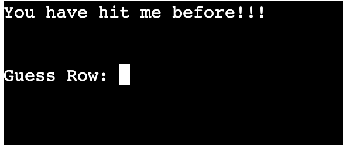

-	If the player inputs the wrong data value, the game will prompt an error message.

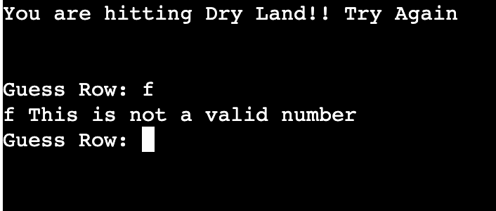

-	If the player hits correctly then the grid is marked with a ‘@’ and the game will tell the player how many guesses it took. Also, the game is over, and the player is the winner. The game will also prompt the player if they would like to play again.

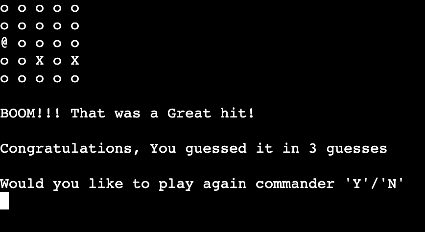

-	If the player uses all their guesses without hitting the target, then the game is over. The game will also prompt the player if they would like to play again.

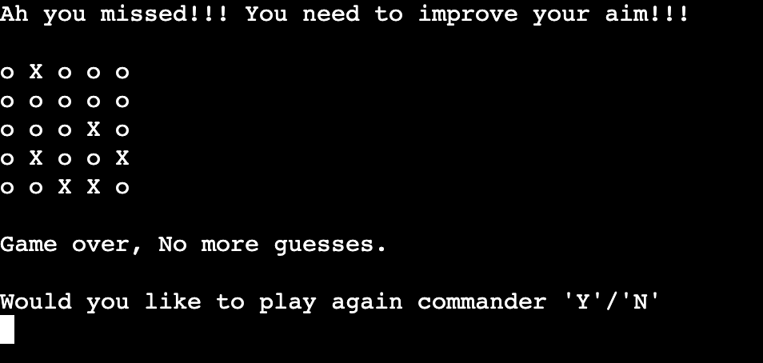
