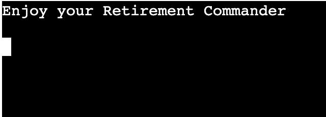

# [BATTLESHIPS](https://battleships84-ac97f9b3f0c3.herokuapp.com)

Battleships is a simple python terminal game which runs in the Code Institute mock terminal on Heroku. Designed for a player to compete against the computer in search of the computers random generated battleship in a grid structure.

## The Game

Battleships allows the player up to six guesses per game on a grid size of 5 x 5. The player is hunting down one ship which is no bigger than 1 square. If the player guesses incorrectly a ‘X’ will be marked on the grid and the player has six attempts to hit the ship until the game is over and the player has lost. However, if the player gets a direct hit a ‘@’ will be marked and the player has won.

## Features

### Existing Features

- **Rules**

    - The rules feature allows the Player who is either new or old to the game the option of viewing the rules before beginning the game. Keeps the game looking clean.

- **start**

    - The start message gives the player the option of proceeding to the game or exiting out of the game.

- **Guessing**

- The board is displayed and the player is prompted to add their guess. Guess row & Guess Col.

-	If the player misses on the board a ‘X’ and a message will appear informing the player. The player will also have used up a guess.

-	If the player guesses a number off the grid, then another message will appear informing the player. Also, the player will not lose a guess for that error.

-	If the player hits the same guess as before then another message will appear.

-	If the player inputs the wrong data value, the game will prompt an error message.

-	If the player hits correctly then the grid is marked with a ‘@’ and the game will tell the player how many guesses it took. Also, the game is over, and the player is the winner. The game will also prompt the player if they would like to play again.

-	If the player uses all their guesses without hitting the target, then the game is over. The game will also prompt the player if they would like to play again.

- **Exit**

-	If the player inputs ‘Y’ the game will repeat however if the player input ‘N’ when prompted, then the game ends.

### Future Features

- Add grid size input.
    - Allows the player to choose the size of the grid.
- Add ships input.
    - Allow the player to choose the number of ships on the grid. 
- Add guesses input.
    - Allow the player to choose the number guesses they can have.
- Allow the computer to guess.
    - The player places their own ships on the grid and then the player can compete against the computer.
- Add scoring system.
    - Allows the player to keep score of the wins and losses.

## Tools & Technologies Used

- [Python](https://www.python.org) used as the back-end programming language.
- [Git](https://git-scm.com) used for version control. (`git add`, `git commit`, `git push`)
- [GitHub](https://github.com) used for secure online code storage.
- [Gitpod](https://gitpod.io) used as a cloud-based IDE for development.
- [Heroku](https://www.heroku.com) used for hosting the deployed back-end site.

## Data Model

### Functions

The primary functions used on this application are:

- `clear()`
    - To clean up the terminal so things do not get messy.
- `rules()`
    - This is to give the new/old player the option.
- `lets_start()`
    - Gives the player the option to start the mission question or exit.
- `new_board()`
    - Creates a new board.
- `print_board()`
    - This is for the aesthetics. Making a neat grid.
- `random_num(board)`
    -  Gives a random number on the row/col which will be the ‘Hidden Ship’ regardless of the board size.
- `validate_num(num)`
    - If player does not use a number as a guess an error message will appear.
- `place_ship()`
    - Keeps the ship in just one place.
- `user_guess()`
    - The player inputs their guess here.
- `correct_guess()`
    - When player makes a guess, the player will get a confirmation message. Hit, miss, or overshot.
- `game()`
    -  Allows the player to have a limited number of guesses before the game ends.
- `lets_go_again()`
    - End of game, gives the player the option to play again.
- `main()`
    - Gives replay function to the game.

### Imports

I've used the following Python packages and/or external imported packages.

- `sys`: used to exit from a `lets_start()` and `let_go_again()` functions
- `os`: used for adding a `clear()` function
- `random`: used to create a random choice 

## Testing

I have used the recommended [PEP8 CI Python Linter](https://pep8ci.herokuapp.com) to validate all of my Python files.

- Tested in my local terminal and the Code Istitute Heroku terminal.

## Unfixed Bugs

There are no remaining bugs that I am aware of.

## Deployment

Code Institute has provided a [template](https://github.com/Code-Institute-Org/python-essentials-template) to display the terminal view of this backend application in a modern web browser.
This is to improve the accessibility of the project to others.

The live deployed application can be found deployed on [Heroku](https://battleships84-ac97f9b3f0c3.herokuapp.com).

### Heroku Deployment

This project uses [Heroku](https://www.heroku.com), a platform as a service (PaaS) that enables developers to build, run, and operate applications entirely in the cloud.

### Acknowledgements

- I would like to thank my Code Institute mentor, [Tim Nelson](https://github.com/TravelTimN) for their support throughout the development of this project.
- I would like to thank the [Code Institute](https://codeinstitute.net) tutor team for their assistance with their understanding of my medical and personal issues.

